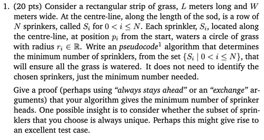

# Hi Marker!
Thank you for marking my assignment!
I have created some scripts compile and run the Java files and tests for your convenience.
Please feel free to use it!
Thank you!

## Run the Program
```
./script.sh
```

[Enter the inputs]

e.g.
```
G4PCV44VFV:cmpt360-asn2-sprinklers trang.nguyen$ ./script.sh
3.0 2.0 1
2.0 5.9
1
```

## Run the Tests Given by the Assignment
```script
./test.sh
```

e.g.
```
G4PCV44VFV:cmpt360-asn2-sprinklers trang.nguyen$ ./test.sh
Check test 1:
---------------------------------
Check test 2:
---------------------------------
Check test 3:
---------------------------------
Check test 4:
---------------------------------
Check test 5:
---------------------------------
```

## Run the Junit Tests
```script
./test_junit.sh
```

e.g.
```
G4PCV44VFV:cmpt360-asn2-sprinklers trang.nguyen$ ./test_junit.sh
added manifest
adding: test/(in = 0) (out= 0)(stored 0%)
adding: test/SprinklerCalculatorTest.class(in = 5360) (out= 1624)(deflated 69%)
adding: test/result/(in = 0) (out= 0)(stored 0%)
adding: test/result/test1(in = 10) (out= 12)(deflated -20%)
adding: test/result/test4(in = 10) (out= 12)(deflated -20%)
adding: test/result/test3(in = 1) (out= 3)(deflated -200%)
adding: test/result/test2(in = 1) (out= 3)(deflated -200%)
adding: test/result/test5(in = 1) (out= 3)(deflated -200%)
adding: main/(in = 0) (out= 0)(stored 0%)
adding: main/Garden.class(in = 2954) (out= 1327)(deflated 55%)
adding: main/Sprinkler.class(in = 1511) (out= 834)(deflated 44%)
adding: main/SprinklerCalculator.class(in = 1496) (out= 996)(deflated 33%)
adding: main/SprinkerCalculator.class(in = 2274) (out= 1022)(deflated 55%)
adding: main/SprinklerProgram.class(in = 2116) (out= 1207)(deflated 42%)
JUnit version 4.13.2
.......................
Time: 0.032

OK (23 tests)
```

# Assignment Detail
## Written Question


Solution: [writtenSolution.pdf](writtenSolution.pdf)

## Programming Question
[programmingQuestion.pdf](programmingQuestion.pdf)